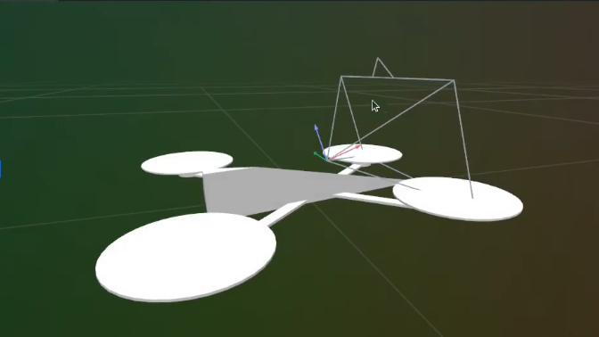
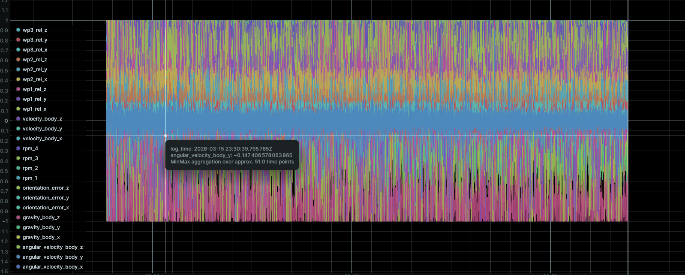
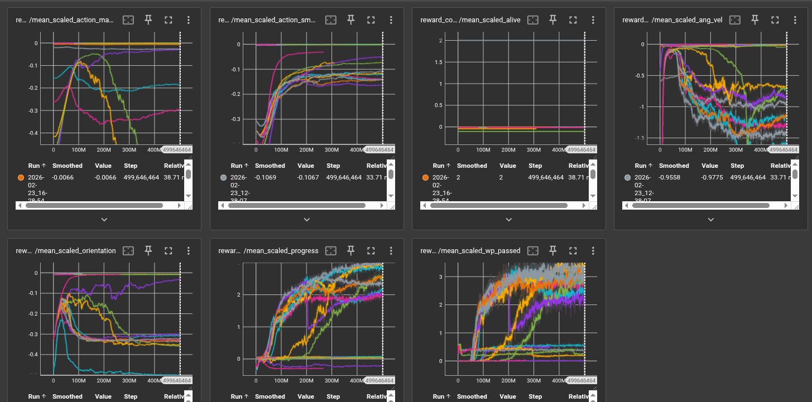
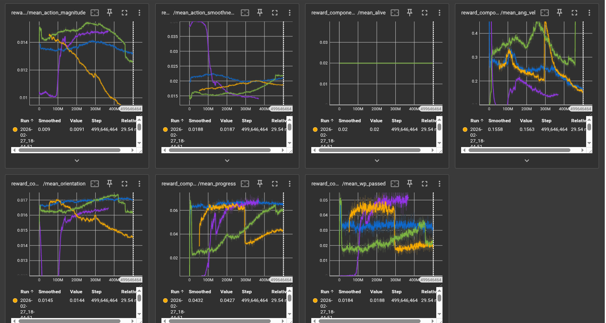
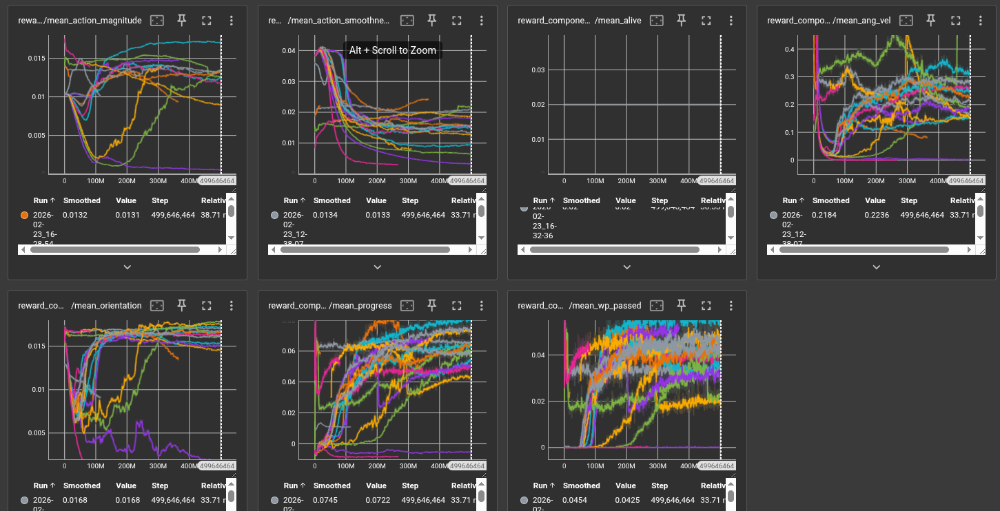
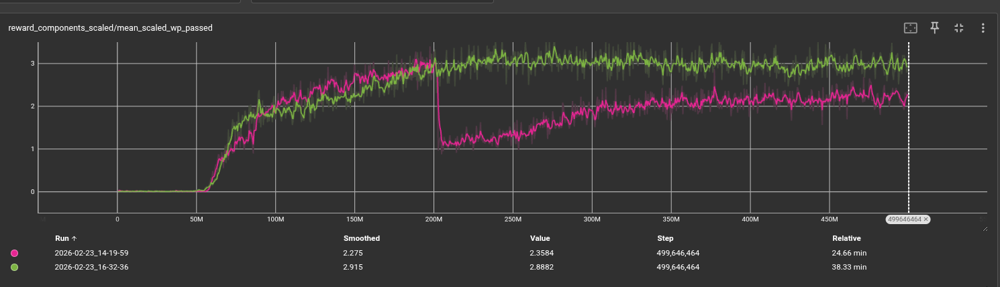
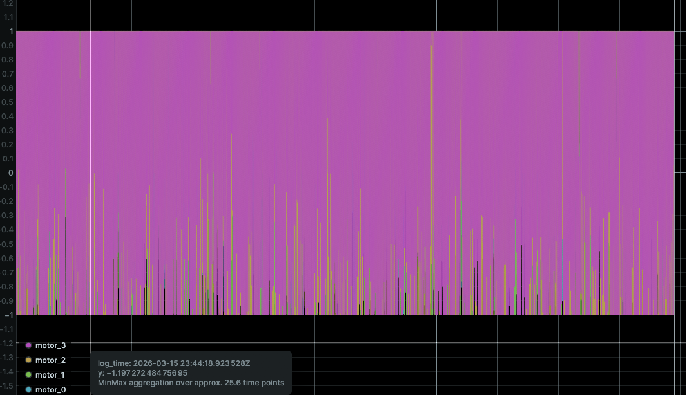

  <iframe src="https://www.youtube.com/embed/ok4VkzBzivo" frameborder="0" allowfullscreen></iframe>

## Project Summary

Autonomous drone navigation is a challenging control problem that interested our group due to our experience with flying commericial drones. Traditional approaches rely on hand-tuned cascaded PID controllers, where engineers manually specify how a drone should respond to positional error, velocity error, and angular error at each level of a control hierarchy. While these controllers work in controlled settings, they are brittle: they require expert tuning for every new platform, fail to generalize across varying dynamics, and cannot easily adapt to complex 3D trajectories through sequences of waypoints.

The challenge we wanted to solve is quadrotor drone to autonomously fly through sequences of 3D waypoints using deep reinforcement learning. Instead of relying on hand-engineered control logic, the agent learns a direct mapping from raw sensor observations (body-frame velocities, angular rates, rotor speeds, and relative waypoint positions) to motor commands. This end-to-end approach is non-trivial: the action space is continuous and four-dimensional (one thrust command per rotor), the physics are nonlinear (quadratic thrust curves, first-order motor delay dynamics), and the reward signal is sparse and delayed. The agent must simultaneously learn to hover, orient toward targets, manage momentum, and pass through gates in three-dimensional space. We model the Crazyflie 2.x nano-quadrotor (mass 36 g, ~28 mm arm length) and simulate realistic aerodynamics entirely on GPU, enabling massively parallel training across thousands of environments simultaneously. The result is a learned policy that progressively masters increasingly difficult waypoint tracks.

## Approach

### Algorithm: Proximal Policy Optimization (PPO)

We use PPO with Generalized Advantage Estimation (GAE). The policy is a diagonal Gaussian: given observation $$s_t$$, the actor outputs a mean $$\mu_\theta(s_t) \in \mathbb{R}^4$$ and a learned (state-independent) log-standard deviation, so actions are sampled as $$a_t \sim \mathcal{N}(\mu_\theta(s_t), \text{diag}(\sigma^2))$$.

**Clipped surrogate objective:**

$$L^{\text{CLIP}}(\theta) = \hat{\mathbb{E}}_t \left[ \min\!\left( r_t(\theta)\,\hat{A}_t,\; \text{clip}(r_t(\theta), 1-\varepsilon, 1+\varepsilon)\,\hat{A}_t \right) \right]$$

where $$r_t(\theta) = \pi_\theta(a_t \mid s_t) / \pi_{\theta_\text{old}}(a_t \mid s_t)$$ is the probability ratio and $$\hat{A}_t$$ is the GAE advantage estimate.

**Combined loss** (policy + value + entropy):

$$L(\theta) = -L^{\text{CLIP}}(\theta) + c_v L^{\text{VF}}(\theta) - c_e H[\pi_\theta]$$

where $$L^{\text{VF}}$$ is a clipped MSE value loss and $$H$$ is the policy entropy bonus.

**GAE advantage** with discount $$\gamma$$ and trace $$\lambda$$:

$$\hat{A}_t = \sum_{k=0}^{T-t-1} (\gamma\lambda)^k \delta_{t+k}, \qquad \delta_t = r_t + \gamma V(s_{t+1}) - V(s_t)$$

### Network Architecture

Both actor and critic share a common encoder: two fully-connected layers of 128 hidden units each with leaky ReLU activations, initialized with orthogonal weight matrices (gain $$\sqrt{2}$$). The actor head is a linear projection to 4 outputs (std 0.01 init) and the critic head is a linear projection to a scalar (std 1.0 init). The $$\log \sigma$$ vector is a free parameter initialized to zero.

### Environment and Physics

The simulation models a Crazyflie 2.x nano-quadrotor. Physics is integrated in PyTorch on GPU with Euler steps at $$\Delta t = 0.01$$ s, with 2 decimation sub-steps per policy step. The environment runs 4,096 instances in parallel using a fully vectorized implementation built with [PufferLib](https://github.com/PufferAI/PufferLib), keeping all physics and reward computation on the GPU and eliminating CPU–GPU transfer overhead. This parallelism is a major contributor to training throughput, allowing us to collect over 500,000 transitions per PPO update. Key physics elements:

- **Thrust model:** Each rotor produces thrust via a quadratic polynomial in RPM: $$F_i = c_0 + c_1 \omega_i + c_2 \omega_i^2$$ (coefficients fit from hardware data).
- **Motor delay:** Rotor speed tracks a commanded value with separate first-order time constants for spin-up ($$\tau_r \approx 83$$ ms) and spin-down ($$\tau_f \approx 284$$ ms).
- **Torques:** Roll/pitch torques from cross products of rotor thrust vectors with arm positions; yaw torque from signed reaction torque constants.
- **Attitude integration:** Quaternion kinematics $$\dot{q} = \tfrac{1}{2} q \otimes \omega_q$$, normalized each step.

### Observations and Actions

The observation vector includes body-frame linear velocities, angular rates, current rotor speeds, and the relative position of the next waypoint in the drone's body frame. Actions are four continuous motor thrust commands in the range $$[-1, 1]$$, mapped to RPM targets for each rotor.

<figure class="eval-figure">
  
  <figcaption>All observation values clamped to the range [-1, 1]. Bounding observations improved training stability by preventing large input magnitudes from producing poor gradient signals early in training.</figcaption>
</figure>

### Reward Function

The total reward per step is:

$$r = r_\text{progress} + r_\text{wp} + r_\text{smooth} + r_\text{mag} + r_\text{ang} + r_\text{orient} + r_\text{alive} + r_\text{crash}$$

| Component | Formula | Scale |
|---|---|---|
| Progress | $$\text{clamp}(\|p_t - g\| - \|p_{t+1} - g\|,\;{-0.5},\;0.2)$$ | $$\times 1$$ |
| Waypoint passage | $$\mathbf{1}[\text{waypoint crossed}]$$ | $$\times 12$$ |
| Action smoothness | $$-\|\Delta \hat{u}\| \cdot \Delta t$$ | $$\times -0.1$$ |
| Action magnitude | $$-\overline{\hat{u}^2} \cdot \Delta t$$ | $$\times -0.2$$ |
| Angular velocity (roll/pitch) | $$-\text{clamp}(\omega_x^2 + \omega_y^2,\;0,\;400) \cdot \Delta t$$ | $$\times -0.1$$ |
| Angular velocity (yaw) | $$-\omega_z^2 \cdot \Delta t$$ | $$\times -0.1$$ |
| Orientation | $$-\tanh(\|\text{err}\|/0.5) \cdot \Delta t$$ | $$\times -0.5$$ |
| Alive | $$\Delta t$$ | $$\times -0.5$$ |
| Crash | $$\mathbf{1}[\text{crash}]$$ | $$\times -10$$ |

Episodes terminate when the drone crashes (z < 0.1 m or z > 5 m), drifts more than 8 m from the current target waypoint, or completes all waypoints on the track.

Reward shaping was one of the most significant challenges of this project. We iterated extensively on scale factors for each component. The action smoothness penalty was critical for preventing bang-bang control behavior, where the drone would oscillate motors at extreme values. The orientation penalty encouraged the drone to face its next waypoint rather than flying sideways. Progress reward uses a clamp to prevent large negative values from dominating when the drone drifts.

### Curriculum and Track Generation

Training uses a 6-level curriculum managed by `CurriculumScheduler`. The level advances when the 100-episode rolling mean reward exceeds a threshold for 5 consecutive evaluations. Track difficulty and dynamics randomization increase together:

| Level | Track types (distribution) | Dynamics $$\delta$$ |
|---|---|---|
| 0 | Straight (100%) | 0% |
| 1 | Straight flat/height (50/50%) | 2% |
| 2 | Circle 50%, circle+height 25%, straight+height 25% | 4% |
| 3 | Circle+height 35%, circle 25%, straight mixes 40% | 6% |
| 4 | Random walk 40%, circle mixes 45%, straight+height 15% | 8% |
| 5 | Random walk mixes 60%, circle mixes 30%, straight+height 10% | 10% |

At each episode reset, thrust coefficients, torque constants, rotor positions, and motor time constants are each independently perturbed by up to $$\pm\delta$$ of their nominal values. This domain randomization is designed to make the learned policy robust to sim-to-real transfer, where physical parameters of a real drone will never exactly match the simulation.

### Hyperparameters

| Hyperparameter | Value |
|---|---|
| Parallel environments | 4,096 |
| Rollout steps per update | 128 |
| Total timesteps | 500,000,000 |
| Learning rate | 0.0003 |
| Discount $$\gamma$$ | 0.999 |
| GAE $$\lambda$$ | 0.95 |
| PPO clip $$\varepsilon$$ | 0.1 |
| Entropy coefficient $$c_e$$ | 0.001 (linearly annealed to 0) |
| Value coefficient $$c_v$$ | 0.5 |
| Update epochs per batch | 4 |
| Minibatches per epoch | 32 |
| Gradient norm clip | 0.5 |
| Hidden layer size | 128 |

Batch size = 4,096 × 128 = 524,288 transitions per update; minibatch size = 16,384. The high discount factor ($$\gamma = 0.999$$) encourages the agent to plan across long horizons, which is necessary to reach distant waypoints. The learning rate is linearly annealed to zero over the course of training, following the CleanRL PPO implementation defaults.

## Evaluation

### Quantitative Evaluation

Training is monitored via rolling episode reward and episode length (averaged over the last 100 completed episodes). The primary metrics are:

- **Mean episode reward:** Measures overall policy quality integrating progress, waypoint passage, and penalty terms.
- **Mean episode length:** A proxy for survival and stability. Longer episodes indicate the drone stays airborne and continues progressing.
- **Waypoints passed per episode:** Directly quantifies navigation success on the track.
- **Curriculum level:** Tracks skill progression from easy to hard tracks.
- **Explained variance:** Measures value function quality; values near 1.0 indicate accurate return prediction.

<figure class="eval-figure">
  
  <figcaption>Scaled rewards across all final training runs. The reward increases steadily during early training before showing signs of plateau.</figcaption>
</figure>

<figure class="eval-figure">
  
  <figcaption>Scaled individual reward components over training for our best run. This view reveals which components dominate and helped us identify when penalties like action smoothness were overwhelming the progress signal.</figcaption>
</figure>

<figure class="eval-figure">
  
  <figcaption>Unscaled reward components over training. Viewing raw values made it easier to diagnose reward shaping issues.</figcaption>
</figure>

<figure class="eval-figure">
  
  <figcaption>Performance of the agent measured in average number of waypoints passed per episode. The dip in the pink line corresponds to a curriculum level transition (change to a harder track geometry). Waypoints passed plateaus around 250M environment steps, indicating the agent has converged on the current reward configuration.</figcaption>
</figure>

### Qualitative Evaluation

[View the live Rerun recording of our last run here](https://rerun.io/viewer?url=https%3A%2F%2Feeshs-rerun-sharing.s3.us-west-1.amazonaws.com%2Fflytosky2_best.rrd) *(will consume RAM)*

We use a logging tool called [Rerun](https://rerun.io) to visualize the first environment during training. This outputs per-step telemetry including position, orientation, rotor speeds, thrust vectors, and waypoint positions. Key qualitative checks we performed:

- **Waypoint orientation:** Does the drone point toward the next waypoint? We verified via Rerun telemetry that the orientation penalty successfully encourages the drone to face its target rather than approaching sideways.
- **Action smoothness:** Does the drone avoid large action changes between steps? We use Rerun to visualize motor command traces over time to identify bang-bang control behavior.
- **Recovery behavior:** Does the drone recover from a poor spawn position and still reach the first waypoint?

<figure class="eval-figure">
  
  <figcaption>Despite extensive iterations on the action smoothness and magnitude penalties, the drone continues to max out motors at extreme values. This leads to an unstable, oscillatory flight rather than smooth control.</figcaption>
</figure>

### Curriculum Validation

We verify each curriculum level independently by checking that the policy achieving threshold reward on level $$k$$ visually succeeds on the corresponding track geometry before the level advances. This prevents the curriculum from advancing prematurely due to reward hacking. In practice, the agent successfully mastered straight-line navigation (levels 0–1) and showed meaningful progress on circular tracks (levels 2–3), but struggled to advance through the random walk levels (4–5) within our training budget.

### Failure Modes and Insights

Several failure modes were identified and informed further development:

1. **Bang-bang motor control:** The policy learned to saturate motors rather than use smooth intermediate throttle. Increasing the smoothness penalty $$\times(-9.0)$$ reduced this but did not fully resolve it.
2. **High motor throttle:** The drone converges to use motors at highest speed which causes it to lose control. This is a difficult behavior to get the drone to avoid.

## Resources Used

- Schulman, J., Wolski, F., Dhariwal, P., Radford, A., & Klimov, O. (2017). *Proximal Policy Optimization Algorithms.* arXiv:1707.06347.
- Jonas Eschmann, Dario Albani, Giuseppe Loianno, *Learning to Fly in Seconds.* [https://arxiv.org/abs/2311.13081](https://arxiv.org/abs/2311.13081)
- Robin Ferede, Till Blaha, Erin Lucassen, Christophe De Wagter, Guido C.H.E. de Croon, *One Net to Rule Them All: Domain Randomization in Quadcopter Racing Across Different Platforms.* [https://arxiv.org/pdf/2504.21586](https://arxiv.org/pdf/2504.21586)
- Aderik Verraest, Stavrow Bahnam, Robin Ferede, Guido de Croon, Christophe De Wagter, *SkyDreamer: Interpretable End-to-End Vision-Based Drone Racing with Model-Based Reinforcement Learning.* [https://arxiv.org/pdf/2510.14783](https://arxiv.org/pdf/2510.14783)
- Huang, S., Dossa, R. F. J., Ye, C., Braga, J., et al. (2022). *CleanRL: High-quality Single-file Implementations of Deep Reinforcement Learning Algorithms.* JMLR 23(274). [https://github.com/vwxyzjn/cleanrl](https://github.com/vwxyzjn/cleanrl)
- Bitcraze AB. *Crazyflie 2.x hardware specifications.* [https://www.bitcraze.io](https://www.bitcraze.io)
- PufferLib: [https://github.com/PufferAI/PufferLib](https://github.com/PufferAI/PufferLib)
- Rerun visualization SDK: [https://rerun.io](https://rerun.io)
- AI tools: Generative AI tools were used for designing the team website, generating boilerplate code, and assisting with report writing structure.
