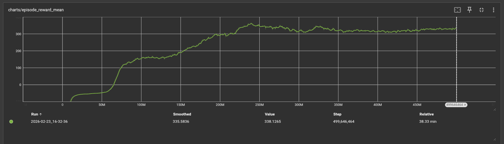
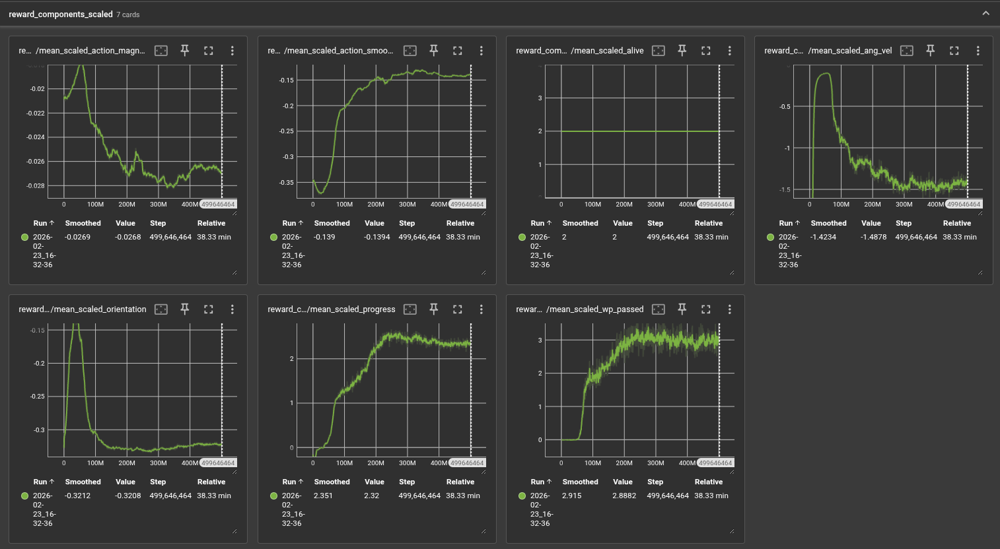
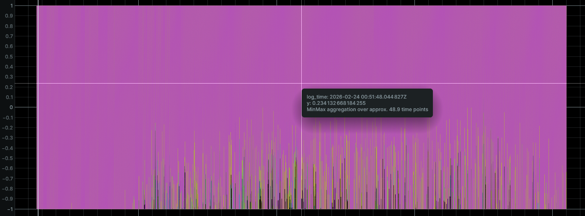
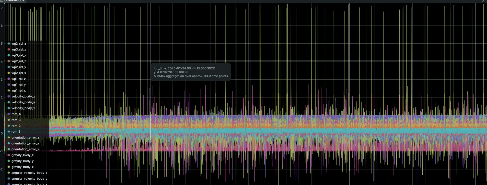

  <iframe src="https://www.youtube.com/embed/hv4wH8m8HZY" frameborder="0" allowfullscreen></iframe>

## Project Summary

FlyToSky trains a quadrotor drone to autonomously fly through sequences of waypoints using deep reinforcement learning. Rather than relying on hand-tuned cascaded PID controllers, the agent learns a direct mapping from raw sensor observations — body-frame velocities, angular rates, rotor speeds, and relative waypoint positions — to continuous motor commands. The environment simulates realistic physics, including a quadratic thrust curve and first-order motor delay dynamics. Training uses Proximal Policy Optimization (PPO) with a curriculum that progressively increases track difficulty from straight-line waypoints to random 3D waypoints, while simultaneously ramping up dynamics randomization to encourage robustness.

## Approach

### Algorithm: Proximal Policy Optimization (PPO)

We use PPO  with Generalized Advantage Estimation (GAE). The policy is a diagonal Gaussian: given observation $$s_t$$, the actor outputs a mean $$\mu_\theta(s_t) \in \mathbb{R}^4$$ and a learned (state-independent) log-standard deviation, so actions are sampled as $$a_t \sim \mathcal{N}(\mu_\theta(s_t), \text{diag}(\sigma^2))$$.

**Clipped surrogate objective:**

$$L^{\text{CLIP}}(\theta) = \hat{\mathbb{E}}_t \left[ \min\!\left( r_t(\theta)\,\hat{A}_t,\; \text{clip}(r_t(\theta), 1-\varepsilon, 1+\varepsilon)\,\hat{A}_t \right) \right]$$

where $$r_t(\theta) = \pi_\theta(a_t \mid s_t) / \pi_{\theta_\text{old}}(a_t \mid s_t)$$ is the probability ratio and $$\hat{A}_t$$ is the GAE advantage estimate.

**Combined loss** (policy + value + entropy):

$$L(\theta) = -L^{\text{CLIP}}(\theta) + c_v L^{\text{VF}}(\theta) - c_e H[\pi_\theta]$$

where $$L^{\text{VF}}$$ is a clipped MSE value loss and $$H$$ is the policy entropy bonus.

**GAE advantage** with discount $$\gamma$$ and trace $$\lambda$$:

$$\hat{A}_t = \sum_{k=0}^{T-t-1} (\gamma\lambda)^k \delta_{t+k}, \qquad \delta_t = r_t + \gamma V(s_{t+1}) - V(s_t)$$

### Network Architecture

Both actor and critic share a common encoder: two fully-connected layers of 128 hidden units each with ReLu activations, initialized with orthogonal weight matrices (gain $$\sqrt{2}$$). The actor head is a linear projection to 4 outputs (std 0.01 init) and the critic head is a linear projection to a scalar (std 1.0 init). The $$\log \sigma$$ vector is a free parameter initialized to zero.

### Environment and Physics

The simulation models a Crazyflie 2.x nano-quadrotor (mass 36 g, ~28 mm arm length). Physics is integrated in PyTorch on GPU with Euler steps at $$\Delta t = 0.01$$ s, with 2 decimation sub-steps per policy step. The environment runs 4,096 instances in parallel using a fully vectorized implementation built with [PufferLib](https://github.com/PufferAI/PufferLib), keeping all physics and reward computation on the GPU and eliminating CPU–GPU transfer overhead. This parallelism is a major contributor to training throughput, allowing us to collect over 500,000 transitions per PPO update. Key elements:

- **Thrust model:** Each rotor produces thrust via a quadratic polynomial in RPM: $$F_i = c_0 + c_1 \omega_i + c_2 \omega_i^2$$ (coefficients fit from hardware data).
- **Motor delay:** Rotor speed tracks a commanded value with separate first-order time constants for spin-up ($$\tau_r \approx 83$$ ms) and spin-down ($$\tau_f \approx 284$$ ms).
- **Torques:** Roll/pitch torques from cross products of rotor thrust vectors with arm positions; yaw torque from signed reaction torque constants.
- **Attitude integration:** Quaternion kinematics $$\dot{q} = \tfrac{1}{2} q \otimes \omega_q$$, normalized each step.

### Reward Function

The total reward per step is:

$$r = r_\text{progress} + r_\text{wp} + r_\text{smooth} + r_\text{mag} + r_\text{ang} + r_\text{orient} + r_\text{alive} + r_\text{crash}$$

| Component | Formula | Scale |
|---|---|---|
| Progress | $$\text{clamp}(\|p_t - g\| - \|p_{t+1} - g\|,\;{-0.5},\;0.2)$$ | $$\times 40$$ |
| Waypoint passage | $$\mathbf{1}[\text{waypoint crossed}]$$ | $$\times 70$$ |
| Action smoothness | $$-\|\Delta \hat{u}\| \cdot \Delta t$$ | $$\times -9.0$$ |
| Action magnitude | $$-\overline{\hat{u}^2} \cdot \Delta t$$ | $$\times -0.5$$ |
| Angular velocity (roll/pitch) | $$-\text{clamp}(\omega_x^2 + \omega_y^2,\;0,\;400) \cdot \Delta t$$ | $$\times -5.5$$ |
| Angular velocity (yaw) | $$-\omega_z^2 \cdot \Delta t$$ | $$\times -0.2$$ |
| Orientation | $$-\tanh(\|\text{err}\|/0.5) \cdot \Delta t$$ | $$\times -20$$ |
| Alive | $$\Delta t$$ | $$\times -0.5$$ |
| Crash | $$\mathbf{1}[\text{crash}]$$ | $$\times -20$$ |

Episodes terminate when the drone crashes (z < 0.1 m or z > 5 m), drifts more than 8 m from the current target waypoint, or completes all waypoints on the track.

### Curriculum and Track Generation

Training uses a 6-level curriculum managed by `CurriculumScheduler`. The level advances when the 100-episode rolling mean reward exceeds a threshold for 5 consecutive evaluations. Track difficulty and dynamics randomization increase together:

| Level | Track types (distribution) | Dynamics $$\delta$$ |
|---|---|---|
| 0 | Straight (100%) | 0% |
| 1 | Straight flat/height (50/50%) | 2% |
| 2 | Circle 50%, circle+height 25%, straight+height 25% | 4% |
| 3 | Circle+height 35%, circle 25%, straight mixes 40% | 6% |
| 4 | Random walk 40%, circle mixes 45%, straight+height 15% | 8% |
| 5 | Random walk mixes 60%, circle mixes 30%, straight+height 10% | 10% |

At each episode reset, thrust coefficients, torque constants, rotor positions, and motor time constants are each independently perturbed by up to $$\pm\delta$$ of their nominal values.

### Hyperparameters

| Hyperparameter | Value |
|---|---|
| Parallel environments | 4,096 |
| Rollout steps per update | 128 |
| Total timesteps | 500,000,000 |
| Learning rate | 3e-4 (linearly annealed to 0) |
| Discount $$\gamma$$ | 0.999 |
| GAE $$\lambda$$ | 0.95 |
| PPO clip $$\varepsilon$$ | 0.1 |
| Entropy coefficient $$c_e$$ | 0.001 (linearly annealed to 0) |
| Value coefficient $$c_v$$ | 0.5 |
| Update epochs per batch | 4 |
| Minibatches per epoch | 32 |
| Gradient norm clip | 0.5 |
| Hidden layer size | 128 |

Batch size = 4,096 × 128 = 524,288 transitions per update; minibatch size = 16,384.

## Evaluation

### Quantitative Evaluation

Training is monitored via rolling episode reward and episode length (averaged over the last 100 completed episodes). The primary metrics are:

- **Mean episode reward:** Measures overall policy quality integrating progress, waypoint passage, and penalty terms.
- **Mean episode length:** A proxy for survival and stability. Longer episodes indicate the drone stays airborne and continues progressing.
- **Waypoints passed per episode:** Directly quantifies navigation success on the track.
- **Curriculum level:** Tracks skill progression from easy to hard tracks.
- **Explained variance:** Measures value function quality; values near 1.0 indicate accurate return prediction.

<figure class="eval-figure">
  
  <figcaption>The progression of how our network improves its rewards over time. </figcaption>
</figure>

<figure class="eval-figure">
  
  <figcaption>Here is the breakdown of rewards. Adding new reward values and reward shaping has been the largest challenge.</figcaption>
</figure>

<figure class="eval-figure">
  
  <figcaption>Here is the performance of the agent measured in the average number of waypoints it passes through. The dip in the pink line is when the curriculum changed (different type of track). The waypoints passed is plateauing around 250m steps. </figcaption>
</figure>

### Qualitative Evaluation

We use a a logging tool called Rerun to visualize the first environment during training. This outputs per-step telemetry including position, orientation, rotor speeds, thrust vectors, and waypoint positions Key qualitative checks:

- Does the drone point toward the next waypoint? (orientation component)
- Does it slow action changes between steps? (smoothness component)
- Does it recover from a poor spawn position and still reach the first waypoint?

<figure class="eval-figure">
  
  <figcaption>An issue we have encountered is the drone's behavior converging to thrust its motors only at extreme speeds. ("bang-bang controls"). This leads to an unstable flight instead of a smooth control. We will try to improve this by adjusting rewards.</figcaption>
</figure>

<figure class="eval-figure">
  
  <figcaption>Another potential challenge we have encountered is scaling the different inputs. For example, the distance of the first waypoint of (wp1_rel_x) was disproportionate to the other observations and likely messed up the weights associated with that feature.</figcaption>
</figure>

### Curriculum Validation

We verify each curriculum level independently by checking that the policy achieving threshold reward on level $$k$$ visually succeeds on the corresponding track geometry before the level advances. This prevents the curriculum from advancing prematurely due to reward hacking.

## Remaining Goals and Challenges

### Current Limitations

The current prototype implements a complete end-to-end PPO pipeline with a realistic physics simulator, curriculum learning, and dynamics randomization but has not yet been trained to a good convergence (plateaus early).

### Goals for the Remainder of the Quarter

1. **Optimal reward shaping:** Our goal is to tune the reward scaling to make the agent converge quicker and to accurately handle more difficult curriculums.
2. **Faster convergence:** Because we iterate over reward shaping and curriculum configurations frequently, reaching competitive performance earlier in training is a priority. We plan to investigate reward scaling, network initialization, and curriculum threshold tuning to reduce the number of environment steps needed to observe meaningful progress per run.
3. **Baseline comparison:** Implement or import a simple PID hover-and-navigate controller and compare tracking error (RMSE to waypoint centers) against the trained RL policy on a fixed test track at each difficulty level.
4. **Sim-to-real considerations:** Identify which physical parameters are most sensitive under dynamics randomization, and discuss whether the trained policy's robustness bounds are plausible for real hardware deployment.
5. **Visualization and demo:** Record Rerun replay logs of the trained policy on held-out tracks at curriculum levels 0–5 and embed them or link them from the website.

## Resources Used

- Schulman, J., Wolski, F., Dhariwal, P., Radford, A., & Klimov, O. (2017). *Proximal Policy Optimization Algorithms.* arXiv:1707.06347.
- Jonas Eschmann, Dario Albani, Giuseppe Loianno, *Learning to Fly in Seconds* https://arxiv.org/abs/2311.13081
- Robin Ferede, Till Blaha, Erin Lucassen, Christophe De Wagter, Guido C.H.E. de Croon, *One Net to Rule Them All: Domain Randomization in Quadcopter Racing Across Different Platforms* 
https:/arxiv.org/pdf/2504.21586
- Aderik Verraest, Stavrow Bahnam, Robin Ferede, Guido de Croon, Christophe De Wagter, *SkyDreamer: Interpretable End-to-End Vision-Based Drone Racing with Model-Based Reinforcement Learning* https://arxiv.org/pdf/2510.14783
- Huang, S., Dossa, R. F. J., Ye, C., Braga, J., et al. (2022). *CleanRL: High-quality Single-file Implementations of Deep Reinforcement Learning Algorithms.* JMLR 23(274). [https://github.com/vwxyzjn/cleanrl](https://github.com/vwxyzjn/cleanrl)
- Bitcraze AB. *Crazyflie 2.x hardware specifications.* [https://www.bitcraze.io](https://www.bitcraze.io)
- PufferLib: [https://github.com/PufferAI/PufferLib](https://github.com/PufferAI/PufferLib)
- Rerun visualization SDK: [https://rerun.io](https://rerun.io)

- AI tools: Generative AI tools used for designing team website and generating boilplate code.